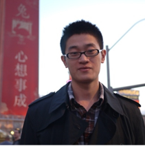

 <!-- .element width="100px" --> I am interested in solving real world problems using computer vision and machine learning. At Adobe, I work on research and tech transfer projects related to deep learning, image processing and intelligent systems. Before joining Adobe, I studied computer vision with [Prof. Stan Sclaroff](http://www.cs.bu.edu/~sclaroff/) at Boston University and got my PhD in 2016.  
[[CV](https://www.dropbox.com/s/cnfsykaoi2p4qa5/CV_JianmingZhang.pdf?dl=0)]  [[Google Scholar](https://scholar.google.com/citations?user=TkVHKDgAAAAJ&hl=en)]  [[PhD Thesis on Saliency Computation](https://www.dropbox.com/s/m9557mlql5e643h/thesis_final.pdf?dl=0)]   Contact: _jianmzha AT adobe.com_  

-------

