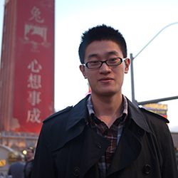
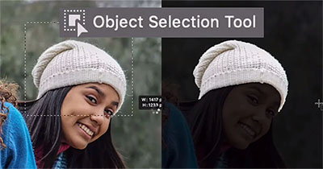
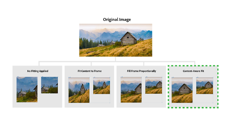

  
  
I am interested in solving real world problems using computer vision and machine learning. At Adobe, I work on research and tech transfer projects related to deep learning, image processing and intelligent systems. Before joining Adobe, I studied computer vision with [Prof. Stan Sclaroff](http://www.cs.bu.edu/~sclaroff/) at Boston University and got my PhD in 2016.  
[[CV](https://www.dropbox.com/s/bjxc0sl13x3cbc2/CV_JianmingZhang.pdf?dl=0)]  [[Google Scholar](https://scholar.google.com/citations?user=TkVHKDgAAAAJ&hl=en)]  [[LinkedIn](www.linkedin.com/in/jianming-zhang-60762227)] [[My Old Website](http://cs-people.bu.edu/jmzhang/)]  
Contact: _jianmzha AT adobe.com_  

-------
## News
* [03/03/2021] Four papers accepted at CVPR 2021. Two of them are selected for oral presentation.
* [10/20/2020] Sky replacement is released in PS [[teaser](https://youtu.be/K_jWJ7Z-tKI)].
* [07/02/2020] Five papers accepted at ECCV 2020.
* [03/04/2020] Three papers accepted at CVPR 2020.
* [07/22/2019] Three papers accepted at ICCV 2019.
* [04/04/2019] Our code for single image shallow DoF is released [[code]](https://github.com/scott89/deeplens_eval)
* [03/15/2019] Two papers accepted at CVPR 2019.
* [03/15/2019] Our paper SmartEye received Best Paper Honorable Mention at CHI.
* [02/06/2019] Received Adobe's _Tech Excellence Award_ with three other amazing colleagues.
* [01/01/2019] One paper on Layout GAN gets accepted at ICLR.
* [01/01/2019] One paper on Mobile Composition Guidance gets accepted at CHI.
* [10/11/2018] The _Content Aware Fit_ and _Content Aware Crop_ feature are shipped in InDesign CC and Illustrator CC ([Demo](https://youtu.be/-43ijHtK_QM)). I developed the key auto cropping technology behind these features. 
* [09/17/2018] Our paper on pointer networks for sequence analysis accepted at NeurIPS.

## Selected Publications

### PhD Thesis
* Visual Saliency Computation for Image Analysis. Boston University, 2016. [[PDF](https://www.dropbox.com/s/m9557mlql5e643h/thesis_final.pdf?dl=0)]  

### Books
* __Jianming Zhang__, Filip Malmberg, Stan Sclaroff. "Visual Saliency: From Pixel-Level to Object-Level Analysis". Springer, 2019. [[Pub](https://www.springer.com/us/book/9783030048303)] 

### Journals
* Andrea Zunino, Sarah Adel Bargal, Pietro Morerio, __Jianming Zhang__, Stan Sclaroff, Vittorio Murino. "Excitation Dropout: Encouraging Plasticity in Deep Neural Networks". _International Journal of Computer Vision (IJCV)_, 2021. [[Pub](https://link.springer.com/article/10.1007/s11263-020-01422-y)]
* Zijun Wei, Boyu Wang, Minh Hoai, __Jianming Zhang__, Xiaohui Shen, Zhe Lin, Radomir Mech, Dimitris Samaras. "Sequence-to-Segments Networks for Detecting Segments in Videos". IEEE Transactions on Pattern Analysis and Machine Intelligence (TPAMI), 2019. [[Pub](https://ieeexplore.ieee.org/abstract/document/8827968)]
* Xin Ye, Zhe Lin, Joon-Young Lee, __Jianming Zhang__, Shibin Zheng, Yezhou Yang. "GAPLE: Generalizable Approaching Policy LEarning for Robotic Object Searching in Indoor Environment". IEEE Robotics and Automation Letters (RAL), 2019. [[arXiv](https://arxiv.org/pdf/1809.08287.pdf)]
* Hao Kang, Haoxiang Li, __Jianming Zhang__, Xin Lu, Bedrich Benes. "FlyCam: Multi-touch Gesture Controlled Drone Gimbal Photography". _IEEE Robotics and Automation Letters_, 2018. (selected to be presented at IROS 2018, Spain) [[Pub](https://ieeexplore.ieee.org/abstract/document/8411115/)]
* Yuqiu Kong, __Jianming Zhang__, Huchuan Lu, Xiuping Liu, "Exemplar-aided Salient Object Detection via Joint Latent Space Embedding". _IEEE Transactions on Image Processing_, 2018. [[Pub](https://ieeexplore.ieee.org/abstract/document/8410567/)]
* Danna Gurari, Kun He, Bo Xiong, __Jianming Zhang__, Mehrnoosh Sameki, Suyog Dutt Jain, Stan Sclaroff, Margrit Betke, Kristen Grauman. "Predicting Foreground Object Ambiguity and Efficiently Crowdsourcing the Segmentation (s)". _International Journal of Computer Vision (IJCV)_, 2018. [[Pub](http://link.springer.com/article/10.1007/s11263-018-1065-7)] [[arXiv](https://arxiv.org/abs/1705.00366)]
* __Jianming Zhang__, Sarah Adel Bargal, Zhe Lin, Xiaohui Shen, Jonathan Brandt, Stan Sclaroff.  "Top-down Neural Attention by Excitation Backprop". _International Journal of Computer Vision (IJCV)_, 2018. [[Pub](https://link.springer.com/article/10.1007/s11263-017-1059-x)] [[Project Page](http://cs-people.bu.edu/jmzhang/excitationbp.html)]
* __Jianming Zhang__, Shugao Ma, Mehrnoosh Sameki, Stan Sclaroff, Margrit Betke, Zhe Lin, Xiaohui Shen, Brian Price and Radomír Měch.  "Salient Object Subitizing". _International Journal of Computer Vision (IJCV)_, 2017. [[Pub](https://link.springer.com/article/10.1007%2Fs11263-017-1011-0)] [[Project Page](http://cs-people.bu.edu/jmzhang/sos.html)]
* Shugao Ma , __Jianming Zhang__, Leonid Sigal, Nazli Ikizler-Cinbis and Stan Sclaroff. "Space-Time Tree Ensemble for Action Recognition". _International Journal of Computer Vision (IJCV)_, 2017. [[Pub](https://link.springer.com/article/10.1007/s11263-016-0980-8)]
* Shugao Ma, Sarah Adel Bargal, __Jianming Zhang__, Leonid Sigal, Stan Sclaroff. "Do Less and Achieve More: Training CNNs for Action Recognition Utilizing Action Images from the Web". _Pattern Recognition_, 2017. [[arXiv](http://arxiv.org/pdf/1512.07155v1.pdf)] [[Project Page](http://cs-people.bu.edu/sbargal/BU-action/)]
* __Jianming Zhang__ and Stan Sclaroff. "Exploiting Surroundedness for Saliency Detection: A Boolean Map Approach". _IEEE Transactions on Pattern Analysis and Machine Intelligence (TPAMI)_, 2016. [[PDF](http://cs-people.bu.edu/jmzhang/BMS/BMS_PAMI_preprint.pdf)] [[Supp](http://cs-people.bu.edu/jmzhang/SOS/SOS_supp.pdf)] [[Project Page](http://cs-people.bu.edu/jmzhang/BMS/BMS.html)]

### Conferences
* Wei Yin, __Jianming Zhang__, Oliver Wang, Simon Niklaus, Long Mai, Simon Chen, Chunhua Shen. "Learning to Recover 3D Scene Shape from a Single Image". In _Proc. IEEE Conference on Computer Vision and Pattern Recognition (CVPR)_, 2021. (__oral__)
* Yichen Sheng, __Jianming Zhang__, Bedrich Benes. "SSN: Soft Shadow Network for Image Compositing". In _Proc. IEEE Conference on Computer Vision and Pattern Recognition (CVPR)_, 2021. (__oral__)
* Qihang Yu, __Jianming Zhang__, He Zhang, Yilin Wang, Zhe Lin, Ning Xu, Yutong Bai, Alan Yuille. "Mask Guided Matting via Progressive Refinement Network". In _Proc. IEEE Conference on Computer Vision and Pattern Recognition (CVPR)_, 2021.
* Xin Yuan, Zhe Lin, Jason Kuen, __Jianming Zhang__, Yilin Wang, Michael Maire, Ajinkya Kale, Baldo Faieta. "Multimodal Contrastive Training for Visual Representation Learning".  In _Proc. IEEE Conference on Computer Vision and Pattern Recognition (CVPR)_, 2021.
* Lu Zhang, __Jianming Zhang__, Zhe Lin, Radomir Mech, Huchuan Lu, You He. "Unsupervised Video Object Segmentation with Joint Hotspot Tracking". In _Proc. European Conference on Computer Vision (ECCV)_, 2020.
* Lijun Wang, __Jianming Zhang__, Yifan Wang, Huchuan Lu, Xiang Ruan. "CLIFFNet for Monocular Depth Estimation with Hierarchical Embedding Loss". In _Proc. European Conference on Computer Vision (ECCV)_, 2020.
* Yu Zeng, Zhe Lin, Jimei Yang, __Jianming Zhang__, Eli Shechtman, and Huchuan Lu. "High-Resolution Image Inpainting with Iterative Confidence Feedback and Guided Upsampling". In _Proc. European Conference on Computer Vision (ECCV)_, 2020.
* Shikun Liu, Zhe Lin, Yilin Wang, __Jianming Zhang__, Federico Perazzi, and Edward Johns. "Shape Adaptor: A Learnable Resizing Module". In _Proc. European Conference on Computer Vision (ECCV)_, 2020.
* Xihui Liu, Zhe Lin, __Jianming Zhang__, Handong Zhao, Quan Tran, Xiaogang Wang, and Hongsheng Li. "Open-Edit: Open-Domain Image Manipulation with Open-Vocabulary Instructions". In _Proc. European Conference on Computer Vision (ECCV)_, 2020.
* Jane L. E, Ohad Fried, Jingwan Lu, __Jianming Zhang__, Radomír Mech, Jose Echevarria, Pat Hanrahan, James A. Landay. "Adaptive Photographic Composition Guidance". In _ACM CHI Conference on Human Factors in Computing Systems Proceedings (CHI)_, 2020. [[Project Page](http://graphics.stanford.edu/projects/adaptivearmatures/)]
* Ke Xian, __Jianming Zhang__, Oliver Wang, Long Mai, Zhe Lin, Zhiguo Cao. "Structure-Guided Ranking Loss for Single Image Depth Prediction". In _Proc. IEEE Conference on Computer Vision and Pattern Recognition (CVPR)_, 2020. [[Project Page](https://kexianhust.github.io/Structure-Guided-Ranking-Loss/)]
* Lijun Wang, __Jianming Zhang__, Oliver Wang, Zhe Lin, Huchuan Lu. "SDC-Depth: Semantic Divide-and-Conquer Network for Monocular Depth Estimation". In _Proc. IEEE Conference on Computer Vision and Pattern Recognition (CVPR)_, 2020. [[PDF](https://github.com/scott89/SDC/blob/master/pdf/main.pdf)]
* Zijun Wei, __Jianming Zhang__, Zhe Lin, Joon-Young Lee, Niranjan Balasubramanian, Minh Hoai Nguyen, Dimitris Samaras. "Learning Visual Emotion Representations from Web Data". In _Proc. IEEE Conference on Computer Vision and Pattern Recognition (CVPR)_, 2020. [[Project Page](https://github.com/cvlab-stonybrook/EmotionNet_CVPR2020)]
* Lu Zhang, Zhe Lin, __Jianming Zhang__, Huchuan Lu, You He. "Fast Video Object Segmentation via Dynamic Targeting Network". In _Proc. IEEE International Conference on Computer Vision (ICCV)_, 2019.
* Yi Zeng, Pingping Zhang, __Jianming Zhang__, Zhe Lin, Huchuan Lu. "Towards High-Resolution Salient Object Detection". In _Proc. IEEE International Conference on Computer Vision (ICCV)_, 2019. [[arXiv](https://arxiv.org/pdf/1908.07274)]
* Jason Kuen, Federico Perazzi, Zhe Lin, __Jianming Zhang__, Yap-Peng Tan. "Scaling Object Detection by Transferring Classification Weights". In _Proc. IEEE International Conference on Computer Vision (ICCV)_, 2019. [[arXiv](https://arxiv.org/pdf/1909.06804)]
* Lu Zhang, __Jianming Zhang__, Zhe Lin, Huchuan Lu, You He. "CapSal: Leveraging Captioning to Boost Semantics for Salient Object Detection". In _Proc. IEEE Conference on Computer Vision and Pattern Recognition (CVPR)_, 2019. [[PDF](http://openaccess.thecvf.com/content_CVPR_2019/papers/Zhang_CapSal_Leveraging_Captioning_to_Boost_Semantics_for_Salient_Object_Detection_CVPR_2019_paper.pdf)] [[Project Page](https://github.com/zhangludl/code-and-dataset-for-CapSal)]
* Siyuan Qiao, Zhe Lin, __Jianming Zhang__, and Alan Yuille. "Neural Rejuvenation: Improving Deep Network Training by Enhancing Computational Resource Utilization". In _Proc. IEEE Conference on Computer Vision and Pattern Recognition (CVPR)_, 2019. (__oral__) [[PDF](http://openaccess.thecvf.com/content_CVPR_2019/papers/Qiao_Neural_Rejuvenation_Improving_Deep_Network_Training_by_Enhancing_Computational_Resource_CVPR_2019_paper.pdf)][[Project Page](https://github.com/joe-siyuan-qiao/NeuralRejuvenation-CVPR19)]
* Shuai Ma, Zijun Wei, Feng Tian, Xiangmin Fan, __Jianming Zhang__, Xiaohui Shen, Zhe Lin, Jin Huang, Radomír Měch, Dimitris Samaras, Hongan Wang. "SmartEye: Assisted Instant Photo Taking via the Integration of User Preferences into the View Proposal Network". In _ACM CHI Conference on Human Factors in Computing Systems Proceedings (CHI)_, 2019. (__Best Paper Honorable Mention__) [[PDF](https://xiangminf.github.io/paper/smarteye-chi19.pdf)]
* Jianan Li, Jimei Yang, Aaron Hertzmann, __Jianming Zhang__ and Tingfa Xu. "LayoutGAN: Generating Graphic Layouts with Wireframe Discriminator". In _Proc. International Conference on Learning Representations (ICLR)_, 2019. [[PDF](https://openreview.net/pdf?id=HJxB5sRcFQ)]
* Zijun Wei, Boyu Wang, Minh Hoai, __Jianming Zhang__, Xiaohui Shen, Zhe Lin, Radomir Mech and Dimitris Samaras. "Sequence-to-Segment Networks for Segment Detection". In _Proc. Advances in Neural Information Processing Systems (NeurIPS)_, 2018. [[PDF](https://www3.cs.stonybrook.edu/~minhhoai/papers/seq2segs_NIPS18.pdf)]
* Lijun Wang, Xiaohui Shen, __Jianming Zhang__, Oliver Wang, Zhe Lin, Chih-Yao Hsieh, Sarah Kong, Huchuan Lu. "DeepLens: Shallow Depth Of Field From A Single Image". In _Proc. Siggraph Asia_, 2018. [[PDF](https://deeplensprj.github.io/deeplens/DeepLens/shallowdof.pdf)] [[Project Page](https://scott89.github.io/deeplens/DeepLens.html)] [[code]](https://github.com/scott89/deeplens_eval)
* Wei-Chih Hung, __Jianming Zhang__, Xiaohui Shen, Zhe Lin, Joon-Young Lee,Ming-Hsuan Yang. "Learning to Blend Photos". In _Proc. European Conference on Computer Vision (ECCV)_, 2018. [[PDF](http://openaccess.thecvf.com/content_ECCV_2018/papers/Wei-Chih_Hung_Learning_to_Blend_ECCV_2018_paper.pdf)] [[Project Page](https://github.com/hfslyc/LearnToBlend)]
* Rameswar Panda, __Jianming Zhang__, Haoxiang Li, Joon-Young Lee, Xin Lu, Amit Roy-Chowdhury, "Contemplating Visual Emotions: Understanding and Overcoming Dataset Bias". In _Proc. European Conference on Computer Vision (ECCV)_, 2018. [[PDF](http://openaccess.thecvf.com/content_ECCV_2018/papers/Rameswar_Panda_Contemplating_Visual_Emotions_ECCV_2018_paper.pdf)] [[Project Page](https://rpand002.github.io/emotion.html)]
* Yufei Wang, Zhe Lin, Xiaohui Shen, Scott Cohen, __Jianming Zhang__. "ConceptMask: Large-Scale Segmentation from Semantic Concepts". In _Proc. European Conference on Computer Vision (ECCV)_, 2018.
* Zijun Wei, __Jianming Zhang__, Min Hoai, Xiaohui Shen, Zhe Lin, Radomir Mech and Dimitris Samaras. "Good View Hunting: Learning Photo Composition from Dense View Pairs". In _Proc. IEEE Conference on Computer Vision and Pattern Recognition (CVPR)_, 2018. [[PDF](http://www.zijunwei.org/papers/cvpr18-photo-composition.pdf)] [[Project Page](http://www.zijunwei.org/VPN_CVPR2018.html)]
* Sarah Adel Bargal\*, Andrea Zunino\*, Donghyun Kim, __Jianming Zhang__, Vittorio Murino, Stan Sclaroff. "Excitation Backprop for RNNs." In _Proc. IEEE Conference on Computer Vision and Pattern Recognition (CVPR)_, 2018. [[PDF](http://cs-people.bu.edu/sbargal/arxiv-CEBR.pdf)] [[Code](https://github.com/sbargal/Caffe-ExcitationBP-RNNs)] 
* Filip Malmberg, Robin Strand, __Jianming Zhang__, Stan Sclaroff. "The Boolean Map Distance: Theory and Efficient Computation". In _Proc. International Conference on Discrete Geometry for Computer Imagery (DGCI)_, 2017. [[Pub](https://link.springer.com/chapter/10.1007/978-3-319-66272-5_27)]
* Vasili Ramanishka, Abir Das, __Jianming Zhang__, Kate Saenko. "Top-down Visual Saliency Guided by Captions".  In _Proc. IEEE Conference on Computer Vision and Pattern Recognition (CVPR)_, 2017. [[PDF](https://arxiv.org/pdf/1612.07360.pdf)] [[Project Page](http://ai.bu.edu/caption-guided-saliency/)]
* __Jianming Zhang__, Zhe Lin, Jonathan Brandt, Xiaohui Shen, Stan Sclaroff. "Top-down Neural Attention by Excitation Backprop". In _Proc. European Conference on Computer Vision (ECCV)_, 2016. (__oral__) [[PDF](http://cs-people.bu.edu/jmzhang/EB/ExcitationBackprop.pdf)] [[Supp](http://cs-people.bu.edu/jmzhang/EB/ExcitationBackprop-supp.pdf)] [[Project Page](http://cs-people.bu.edu/jmzhang/excitationbp.html)]
* __Jianming Zhang__, Stan Sclaroff, Zhe Lin, Xiaohui Shen, Brian Price and Radomír Měch. "Unconstrained Salient Object Detection via Proposal Subset Optimization". In _Proc. IEEE Conference on Computer Vision and Pattern Recognition (CVPR)_, 2016. (__spotlight__) [[PDF](http://cs-people.bu.edu/jmzhang/SOD/CVPR16SOD_camera_ready.pdf)] [[Supp](http://cs-people.bu.edu/jmzhang/SOD/supp_camera_ready.pdf)] [[Project Page](http://cs-people.bu.edu/jmzhang/sod.html)]
* __Jianming Zhang__, Stan Sclaroff, Zhe Lin, Xiaohui Shen, Brian Price and Radomír Měch. "Minimum Barrier Salient Object Detection at 80 FPS". In _Proc. IEEE International Conference on Computer Vision (ICCV)_, 2015. (__oral__) [[PDF](http://cs-people.bu.edu/jmzhang/fastmbd/MBS_preprint.pdf)] [[Project Page](http://cs-people.bu.edu/jmzhang/fastmbd.html)]
* __Jianming Zhang__, Shugao Ma, Mehrnoosh Sameki, Stan Sclaroff, Margrit Betke, Zhe Lin, Xiaohui Shen, Brian Price and Radomír Měch. "Salient Object Subitizing". In _Proc. IEEE Conference on Computer Vision and Pattern Recognition (CVPR)_, 2015. [[PDF](http://cs-people.bu.edu/jmzhang/SOS/SOS_preprint.pdf)] [[Supp](http://cs-people.bu.edu/jmzhang/SOS/SOS_supp.pdf)] [[Project Page](http://cs-people.bu.edu/jmzhang/sos.html)]
* __Jianming Zhang__, Shugao Ma and Stan Sclaroff. "MEEM: Robust Tracking via Multiple Experts using Entropy Minimization". In _Proc. European Conference on Computer Vision (ECCV)_, 2014. [[PDF](http://cs-people.bu.edu/jmzhang/MEEM/MEEM-eccv-preprint.pdf)] [[Supp](http://cs-people.bu.edu/jmzhang/MEEM/supplementary.pdf)] [[Project Page](http://cs-people.bu.edu/jmzhang/MEEM/MEEM.html)]
* __Jianming Zhang__ and Stan Sclaroff. "Saliency Detection: A Boolean Map Approach". In Proc. _IEEE Internetional Conference on Computer Vision (ICCV)_, 2013. [[PDF](http://cs-people.bu.edu/jmzhang/BMS/BMS_iccv13_preprint.pdf)] [[Project Page](http://cs-people.bu.edu/jmzhang/BMS/BMS.html)]
* Shugao Ma, __Jianming Zhang__, Nazli Ikizler-Cinbis and Stan Sclaroff. "Action Recognition and Localization by Hierarchical Space-Time Segments". In _Proc. IEEE Internetional Conference on Computer Vision (ICCV)_, 2013. [[PDF](http://cs-people.bu.edu/shugaoma/STSegments/iccv2013_preprint_shugao.pdf)] [[Project Page](http://cs-people.bu.edu/shugaoma/STSegments/STSegments.html)]
* __Jianming Zhang__, Liliana  Lo Presti and Stan Sclaroff, "Online Multi-Person Tracking by Tracker Hierarchy". In _Proc. IEEE Conference on Advanced Video and Signal Based Surveillance (AVSS)_, 2012. [[PDF](http://www.cs.bu.edu/groups/ivc/software/TrackerHierarchy/AVSS2012_TrackerHierarchy.pdf)] [[Project Page](http://cs-people.bu.edu/jmzhang/tracker_hierarchy/Tracker_Hierarchy.htm)]

### Patents
50+ pending or issued patents:
* Large-scale image tagging using image-to-topic embedding ([US 10216766B2](https://patentimages.storage.googleapis.com/c2/da/52/caf2af341f092b/US10216766.pdf))
* Semantic Class Localization in Images ([US 9846840](http://www.freepatentsonline.com/y2017/0344884.html))
* Generating Image Features Based on Robust Feature-Learning ([US 9830526](http://www.freepatentsonline.com/9830526.html))
* Accurate Tag Relevance Prediction for Image Search ([Pending](https://www.google.com/patents/US20170236055), International)
* Image Zooming ([US 9805445](https://www.google.com/patents/US9805445))
* Image Cropping Suggestion Using Multiple Saliency Maps ([US 9626584](https://www.google.com/patents/US9626584))
* Saliency Map Computation ([US 9454712](https://www.google.com/patents/US9454712))

## Honors and Awards
* Best Paper Honorable Mention, CHI 2019
* Technical Excellence Award, Adobe 2019
* Outstanding Reviewer, CVPR 2017

## Tech Transfer Highlights

* __Sky Replacement__ in Photoshop 2021 [[Youtube](https://youtu.be/K_jWJ7Z-tKI)]. Starting as a research project years ago, we spent a lot of effort to make this technology achieve the quality level that would satifiy the picky professionals. I developed the backbone masking and compositing technologies and worked closely with the PS team to polish this feature. The final form of this feature is simple, flexible and powerful. It just shines! See what professionals say [[rephotojournal.com](https://rephotojournal.com/photoshop-sky-replacement-for-real-estate-photography/)] [[PHLEARN](https://youtu.be/ognLpUNLDwM)] [[PiXimperfect](https://youtu.be/I3dI5iHUH2U?t=35)].

---

* __Object Selection Tool__ in Photoshop 2020 [[Youtube](https://youtu.be/0Qm5nS2PMBs)]. After nearly three years' development, engineering and testing, we shipped this new interative selection tool. It makes the selection so intuitive and easy. See reviews from the profesionals [[PiXimperfect](https://youtu.be/ZIXM37H0mzs?t=87)] [[PTC](https://youtu.be/bgiWPuNT4PQ)] [[YES](https://youtu.be/f8_S8M6ZJt4)].

---

* __Conten Aware Fit__ in InDesign CC 2019 [[Youtube](https://youtu.be/-43ijHtK_QM)]. The key technology behind this is an automatic image cropping algorithm we started to develop years ago. Since then, the algorithm went through several iterations and I was the main developer for the latest version.

---

 
* __Select Subject__ in Photoshop CC 2018 [[Youtube](https://youtu.be/x-9qYLr15tU)]. Deep learning based salient object detection with high boundary accuracy. This is one of the first few Sensei powered features in Adobe flagship products. I designed and developed the deep learning algorithm behind this feature. Media coverage: [[PetaPixel](https://petapixel.com/2018/01/23/select-subject-photoshop-now-ai-powered-one-click-selections/)], [[TechCrunch](https://techcrunch.com/2018/01/23/adobe-photoshop-cc-now-makes-selecting-objects-a-one-click-affair/)], [[Engaget](https://www.engadget.com/2018/01/23/photoshops-ai-select-subject/)].

## Former Interns
* Wei Yin, Adelaide University, 2020
* Qihang Yu, John Hopkins University, 2020
* Lu Zhang, Dalian University of Technology, 2019.
* Yichen Sheng, Purdue University, 2019
* [Ke Xian](https://sites.google.com/site/kexian1991/), Huazhong University of Science and Technology, 2019
* [He Zhang](https://sites.google.com/site/hezhangsprinter/), Rutgers University, 2018
* [Haichao Yu](http://www.haichaoyu.me/home), UIUC, 2018
* [Kang Hao](https://www.linkedin.com/in/haokang2017/), Purdue University, 2018 
* [Lijun Wang](https://scholar.google.com/citations?user=EfTwkXMolscC&hl=en), Dalian University of Technology, 2017.
* Jianan Li, Beijing Institute of Technology, 2017.
* [Zhe Wang](http://wangzheallen.github.io/), UC Irvine, 2017.
* [Rameswar Panda](https://rpand002.github.io/), UC Riverside, 2017.
* [Wei-Chih (Wayne) Hung](https://hfslyc.github.io/), UC Merced, 2017.
* [Zijun Wei](http://www.zijunwei.org/), Stony Brook University, 2017, 2018.

