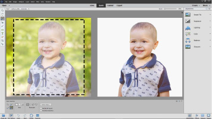

  
  
I am interested in solving real world problems using computer vision and machine learning. At Adobe, I work on research and tech transfer projects related to deep learning, image processing and intelligent systems. Before joining Adobe, I studied computer vision with [Prof. Stan Sclaroff](http://www.cs.bu.edu/~sclaroff/) at Boston University and got my PhD in 2016.  
[[CV](https://www.dropbox.com/s/cnfsykaoi2p4qa5/CV_JianmingZhang.pdf?dl=0)]  [[Google Scholar](https://scholar.google.com/citations?user=TkVHKDgAAAAJ&hl=en)]  [[LinkedIn](www.linkedin.com/in/jianming-zhang-60762227)] [[My Old Website](http://cs-people.bu.edu/jmzhang/)]  
Contact: _jianmzha AT adobe.com_  

-------
## News
* [02/20/2018] Two papers get accepted at CVPR.
* [01/23/2018] The _Select Subject_ feature is shipped in Photoshop CC, which is my first major tech transfer in Adobe flagship products. Media coverage: [[PetaPixel](https://petapixel.com/2018/01/23/select-subject-photoshop-now-ai-powered-one-click-selections/)], [[TechCrunch](https://techcrunch.com/2018/01/23/adobe-photoshop-cc-now-makes-selecting-objects-a-one-click-affair/)], [[Engaget](https://www.engadget.com/2018/01/23/photoshops-ai-select-subject/)].
* [01/09/2018] Our paper on object segmentation ambiguity is accepted at IJCV. [[arXiv](https://arxiv.org/abs/1705.00366)]
* [12/16/2017] The journal version of our Excitation Backprop work is accepted at IJCV.

## Selected Publications

### PhD Thesis
* Visual Saliency Computation for Image Analysis. Boston University, 2016. [[PDF](https://www.dropbox.com/s/m9557mlql5e643h/thesis_final.pdf?dl=0)]  

### Journals
* Danna Gurari, Kun He, Bo Xiong, __Jianming Zhang__, Mehrnoosh Sameki, Suyog Dutt Jain, Stan Sclaroff, Margrit Betke, Kristen Grauman. "Predicting Foreground Object Ambiguity and Efficiently Crowdsourcing the Segmentation (s)". _International Journal of Computer Vision (IJCV)_, 2018. [[Pub](http://link.springer.com/article/10.1007/s11263-018-1065-7)] [[arXiv](https://arxiv.org/abs/1705.00366)]
* __Jianming Zhang__, Sarah Adel Bargal, Zhe Lin, Xiaohui Shen, Jonathan Brandt, Stan Sclaroff.  "Top-down Neural Attention by Excitation Backprop". _International Journal of Computer Vision (IJCV)_, 2018. [[Pub](https://link.springer.com/article/10.1007/s11263-017-1059-x)] [[Project Page](http://cs-people.bu.edu/jmzhang/excitationbp.html)]
* __Jianming Zhang__, Shugao Ma, Mehrnoosh Sameki, Stan Sclaroff, Margrit Betke, Zhe Lin, Xiaohui Shen, Brian Price and Radomír Měch.  "Salient Object Subitizing". _International Journal of Computer Vision (IJCV)_, 2017. [[Pub](https://link.springer.com/article/10.1007%2Fs11263-017-1011-0)] [[Project Page](http://cs-people.bu.edu/jmzhang/sos.html)]
* Shugao Ma , __Jianming Zhang__, Leonid Sigal, Nazli Ikizler-Cinbis and Stan Sclaroff. "Space-Time Tree Ensemble for Action Recognition". _International Journal of Computer Vision (IJCV)_, 2017. [[Pub](https://link.springer.com/article/10.1007/s11263-016-0980-8)]
* Shugao Ma, Sarah Adel Bargal, __Jianming Zhang__, Leonid Sigal, Stan Sclaroff. "Do Less and Achieve More: Training CNNs for Action Recognition Utilizing Action Images from the Web". _Pattern Recognition_, 2017. [[arXiv](http://arxiv.org/pdf/1512.07155v1.pdf)] [[Project Page](http://cs-people.bu.edu/sbargal/BU-action/)]
* __Jianming Zhang__ and Stan Sclaroff. "Exploiting Surroundedness for Saliency Detection: A Boolean Map Approach". _IEEE Transactions on Pattern Analysis and Machine Intelligence (TPAMI)_, 2016. [[PDF](http://cs-people.bu.edu/jmzhang/BMS/BMS_PAMI_preprint.pdf)] [[Supp](http://cs-people.bu.edu/jmzhang/SOS/SOS_supp.pdf)] [[Project Page](http://cs-people.bu.edu/jmzhang/BMS/BMS.html)]

### Conferences
* Zijun Wei, __Jianming Zhang__, Xiaohui Shen, Zhe Lin, Radomir Mech, Min Hoai and Dimitris Samaras. "Good View Hunting: Learning Photo Composition from View Pairs". In _Proc. IEEE Conference on Computer Vision and Pattern Recognition (CVPR)_, 2018.
* Sarah Adel Bargal*, Andrea Zunino*, Donghyun Kim, __Jianming Zhang__, Vittorio Murino, Stan Sclaroff. "Excitation Backprop for RNNs." In _Proc. IEEE Conference on Computer Vision and Pattern Recognition (CVPR)_, 2018. 
* Filip Malmberg, Robin Strand, __Jianming Zhang__, Stan Sclaroff. "The Boolean Map Distance: Theory and Efficient Computation". In _Proc. International Conference on Discrete Geometry for Computer Imagery (DGCI)_, 2017. [[Pub](https://link.springer.com/chapter/10.1007/978-3-319-66272-5_27)]
* Vasili Ramanishka, Abir Das, __Jianming Zhang__, Kate Saenko. "Top-down Visual Saliency Guided by Captions".  In _Proc. IEEE Conference on Computer Vision and Pattern Recognition (CVPR)_, 2017. [[PDF](https://arxiv.org/pdf/1612.07360.pdf)] [[Project Page](http://ai.bu.edu/caption-guided-saliency/)]
* __Jianming Zhang__, Zhe Lin, Jonathan Brandt, Xiaohui Shen, Stan Sclaroff. "Top-down Neural Attention by Excitation Backprop". In _Proc. European Conference on Computer Vision (ECCV)_, 2016. (__oral__) [[PDF](http://cs-people.bu.edu/jmzhang/EB/ExcitationBackprop.pdf)] [[Supp](http://cs-people.bu.edu/jmzhang/EB/ExcitationBackprop-supp.pdf)] [[Project Page](http://cs-people.bu.edu/jmzhang/excitationbp.html)]
* __Jianming Zhang__, Stan Sclaroff, Zhe Lin, Xiaohui Shen, Brian Price and Radomír Měch. "Unconstrained Salient Object Detection via Proposal Subset Optimization". In _Proc. IEEE Conference on Computer Vision and Pattern Recognition (CVPR)_, 2016. (__spotlight__) [[PDF](http://cs-people.bu.edu/jmzhang/SOD/CVPR16SOD_camera_ready.pdf)] [[Supp](http://cs-people.bu.edu/jmzhang/SOD/supp_camera_ready.pdf)] [[Project Page](http://cs-people.bu.edu/jmzhang/sod.html)]
* __Jianming Zhang__, Stan Sclaroff, Zhe Lin, Xiaohui Shen, Brian Price and Radomír Měch. "Minimum Barrier Salient Object Detection at 80 FPS". In _Proc. IEEE International Conference on Computer Vision (ICCV)_, 2015. (__oral__) [[PDF](http://cs-people.bu.edu/jmzhang/fastmbd/MBS_preprint.pdf)] [[Project Page](http://cs-people.bu.edu/jmzhang/fastmbd.html)]
* __Jianming Zhang__, Shugao Ma, Mehrnoosh Sameki, Stan Sclaroff, Margrit Betke, Zhe Lin, Xiaohui Shen, Brian Price and Radomír Měch. "Salient Object Subitizing". In _Proc. IEEE Conference on Computer Vision and Pattern Recognition (CVPR)_, 2015. [[PDF](http://cs-people.bu.edu/jmzhang/SOS/SOS_preprint.pdf)] [[Supp](http://cs-people.bu.edu/jmzhang/SOS/SOS_supp.pdf)] [[Project Page](http://cs-people.bu.edu/jmzhang/sos.html)]
* __Jianming Zhang__, Shugao Ma and Stan Sclaroff. "MEEM: Robust Tracking via Multiple Experts using Entropy Minimization". In _Proc. European Conference on Computer Vision (ECCV)_, 2014. [[PDF](http://cs-people.bu.edu/jmzhang/MEEM/MEEM-eccv-preprint.pdf)] [[Supp](http://cs-people.bu.edu/jmzhang/MEEM/supplementary.pdf)] [[Project Page](http://cs-people.bu.edu/jmzhang/MEEM/MEEM.html)]
* __Jianming Zhang__ and Stan Sclaroff. "Saliency Detection: A Boolean Map Approach". In Proc. _IEEE Internetional Conference on Computer Vision (ICCV)_, 2013. [[PDF](http://cs-people.bu.edu/jmzhang/BMS/BMS_iccv13_preprint.pdf)] [[Project Page](http://cs-people.bu.edu/jmzhang/BMS/BMS.html)]
* Shugao Ma, __Jianming Zhang__, Nazli Ikizler-Cinbis and Stan Sclaroff. "Action Recognition and Localization by Hierarchical Space-Time Segments". In _Proc. IEEE Internetional Conference on Computer Vision (ICCV)_, 2013. [[PDF](http://cs-people.bu.edu/shugaoma/STSegments/iccv2013_preprint_shugao.pdf)] [[Project Page](http://cs-people.bu.edu/shugaoma/STSegments/STSegments.html)]
* __Jianming Zhang__, Liliana  Lo Presti and Stan Sclaroff, "Online Multi-Person Tracking by Tracker Hierarchy". In _Proc. IEEE Conference on Advanced Video and Signal Based Surveillance (AVSS)_, 2012. [[PDF](http://www.cs.bu.edu/groups/ivc/software/TrackerHierarchy/AVSS2012_TrackerHierarchy.pdf)] [[Project Page](http://cs-people.bu.edu/jmzhang/tracker_hierarchy/Tracker_Hierarchy.htm)]

### Patents
* Semantic Class Localization in Images ([US 9846840](http://www.freepatentsonline.com/y2017/0344884.html))
* Generating Image Features Based on Robust Feature-Learning ([US 9830526](http://www.freepatentsonline.com/9830526.html))
* Accurate Tag Relevance Prediction for Image Search ([Pending](https://www.google.com/patents/US20170236055), International)
* Image Zooming ([US 9805445](https://www.google.com/patents/US9805445))
* Image Cropping Suggestion Using Multiple Saliency Maps ([US 9626584](https://www.google.com/patents/US9626584))
* Saliency Map Computation ([US 9454712](https://www.google.com/patents/US9454712))

## Tech Transfer Highlights

 
* __Select Subject__ in Photoshop CC 2018 [[Youtube](https://youtu.be/x-9qYLr15tU)]. Deep learning based salient object detection with high boundary accuracy. This is one of the first few Sensei powered features in Adobe flagship products. I designed and developed the deep learning algorithm behind this feature. Media coverage: [[PetaPixel](https://petapixel.com/2018/01/23/select-subject-photoshop-now-ai-powered-one-click-selections/)], [[TechCrunch](https://techcrunch.com/2018/01/23/adobe-photoshop-cc-now-makes-selecting-objects-a-one-click-affair/)], [[Engaget](https://www.engadget.com/2018/01/23/photoshops-ai-select-subject/)].

---

 
* __Auto Selection__ in Photoshop Elements 2018 [[Youtube](https://youtu.be/kXUW1Z_f5Ug)]. Deep learning based interactive image segmentation. I designed and developed the deep learning algorithm behind this feature.

## Former Interns
* [Kang Hao](https://www.linkedin.com/in/haokang2017/), Purdue University, 2018 
* [Lijun Wang](https://scholar.google.com/citations?user=EfTwkXMolscC&hl=en), Dalian University of Technology, 2017.
* Jianan Li, NUS, 2017.
* [Zhe Wang](http://wangzheallen.github.io/), UC Irvine, 2017.
* [Rameswar Panda](https://rpand002.github.io/), UC Riverside, 2017.
* [Wei-Chih (Wayne) Hung](https://hfslyc.github.io/), UC Merced, 2017.
* [Zijun Wei](http://www.zijunwei.org/), Stony Brook University, 2017.

